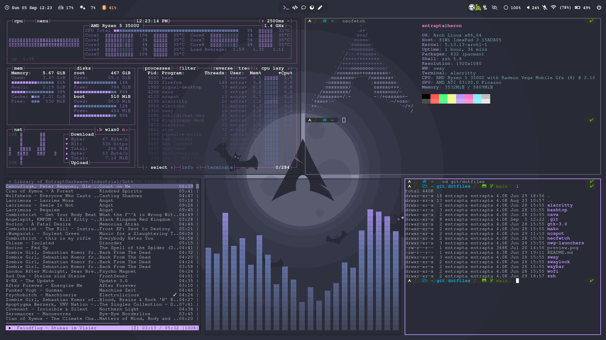

# dotfiles
dotfiles and configs for heron laptop  
running ArchLinux (btw) with sway WM, no DE  
Using [Dracula Theme](https://draculatheme.com/) wherever possible for a consistent look.

## what it currently looks like

## The Packages
- [alacritty](https://github.com/alacritty/alacritty) - Terminal emulator
- brightnessctl - Monitor brightness control
- [cava](https://aur.archlinux.org/packages/cava/) (AUR) - CLI audio visualizer
- [font-awesome](https://archlinux.org/packages/community/any/font-awesome/) - Fancy icons - [Icon Picker](https://fontawesome.com/v5.15/icons?d=gallery&p=2&m=free)
- [grim](https://github.com/emersion/grim) - Image grabber
- [grimshot](https://aur.archlinux.org/packages/grimshot/) (AUR) - Better screenshot handling
- feh - image viewer
- [mako](https://github.com/emersion/mako) - notifications
- [oh-my-zsh](https://github.com/ohmyzsh/ohmyzsh/) - fancy things for zfs shell
- pavucontrol - PulseAudio Volume Control
- playerctl - enable media controls keys
- [powerlevel10k](https://github.com/romkatv/powerlevel10k) ([AUR](https://aur.archlinux.org/packages/zsh-theme-powerlevel10k-git/)) - theme and style for zfs shell
- [sway](https://github.com/swaywm/sway)
- [swaylock-effects](https://github.com/mortie/swaylock-effects) - Better lockscreen
- [wal](https://github.com/dylanaraps/wal) (AUR) - Colorscheme templates
- [waybar](https://github.com/Alexays/Waybar)
- [wofi](https://hg.sr.ht/~scoopta/wofi) - dmenu replacement
- zsh - shell replacement

## symlinks used
*(This needs a proper cleanup and an automated script at some point.)*

## Credits
Many thanks to a bunch of people from whom I have gotten inspiration or taken code snippets from.  
This includes: [mmphego](https://github.com/mmphego/dot-files), [Madic-](https://github.com/Madic-/Sway-DE), [nboughton](https://github.com/nboughton/dotfiles), and more.
