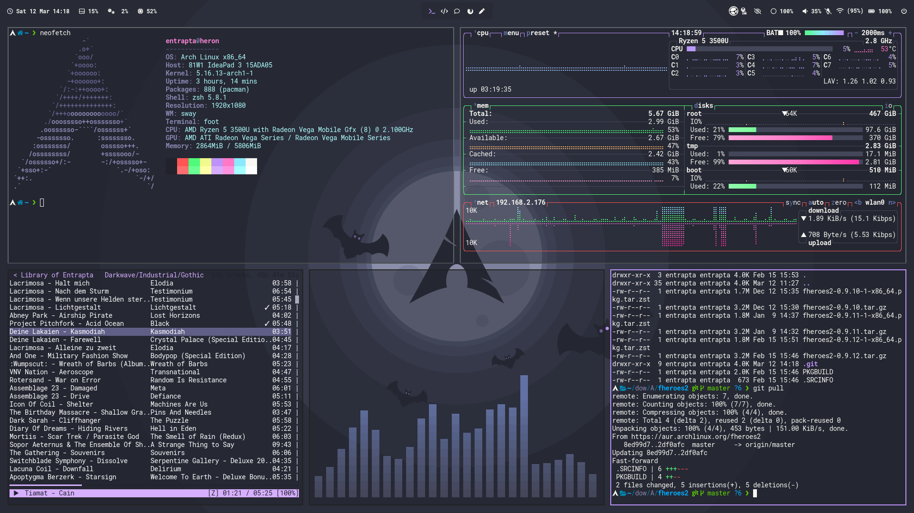

# dotfiles
dotfiles and configs for heron laptop  
this readme is a work in progress  
so are the dotfiles  
honestly, I have no idea what I'm doing  
this is my first time messing around with a window manager  
not to mention arch (btw)  

## what it currently looks like


## The Packages
- [Alacritty](https://github.com/alacritty/alacritty) - Terminal emulator
- [wob](https://github.com/francma/wob) - on screen display
- [grim](https://github.com/emersion/grim) - Screenshots
- [grimshot](https://aur.archlinux.org/packages/grimshot/) (AUR) - Better screenshot handling
- feh - image viewer
- [mako](https://github.com/emersion/mako) - notifications
- --blueman-- bluetooth manager
- [sway](https://github.com/swaywm/sway)  
- [waybar](https://github.com/Alexays/Waybar)
- wofi - dmenu replacement
- wal - Colorscheme templates
- ...

## symlinks
```
sudo ln -s ~/Sync/git/dotfiles/sway/config ~/.config/sway/config
sudo ln -s ~/Sync/git/dotfiles/waybar/config ~/.config/waybar/config
sudo ln -s ~/Sync/git/dotfiles/waybar/style.css ~/.config/waybar/style.css
sudo ln -s ~/Sync/git/dotfiles/alacritty/alacritty.yml ~/.config/alacritty/alacritty.yml
sudo ln -s ~/Sync/git/dotfiles/alacritty/dracula.yml ~/.config/alacritty/dracula.yml
```

## Credits
Many thanks to a bunch of people from whom I have gotten inspiration or taken code snippets from.  
This includes: [mmphego](https://github.com/mmphego/dot-files), [Madic-](https://github.com/Madic-/Sway-DE), [nboughton](https://github.com/nboughton/dotfiles), and more.
